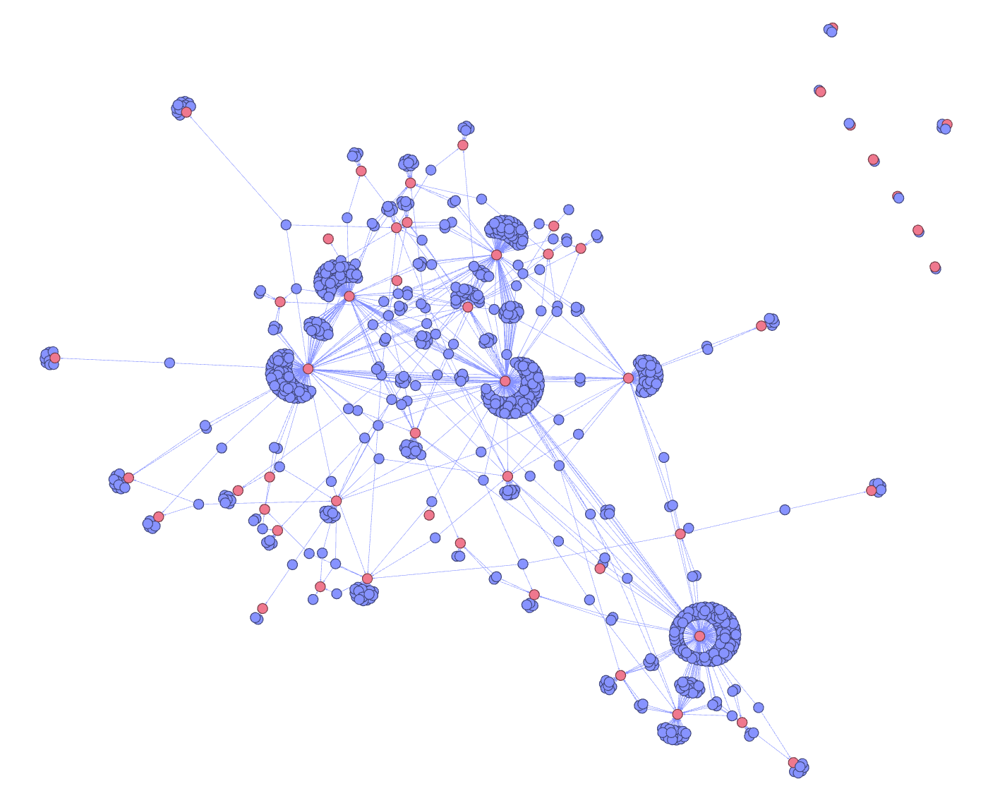

# STEntConv

This repo contains code to train STEntConv, a model built to detect whether a social media comment and its reply agree or disagree (or neither). 

For each user in the dataset, it extracts the named entities mentioned in all their posts, then creates 'pro' and 'con' sentence embeddings using SBERT and takes the difference between 'pro' and 'con' cosine similarity as the stance of this user towards that particular entity. 

At training time, it uses a modified version of the Pytorch-geometric implementation of the Signed Graph Convolutional Network from  to produce embeddings for the users from their entities graph which are used as features along with the output of a BERT layer for classifying pairs of posts.

## Dependencies
The code requires `Python>=3.10`, `torch>=2.0` and `torch-geometric>=2.3` (for `torch-scatter` and other specific dependencies, follow instructions on the Pytorch geometric website which are tailored to CUDA version). It also requires specifically `gensim==4.2.0`.

## Data preparation
The model requires the user-entities graph (positive and negative edges) for training and test set. The positive and negative edges found in the data folder were extracted using the get_pos_neg_edges function in helper_functions.py. 
## Training
The model can be trained by running train.py with the relevant arguments, e.g., 
    
    python -m train.py --data_dir ../data --trained_path model.pth

